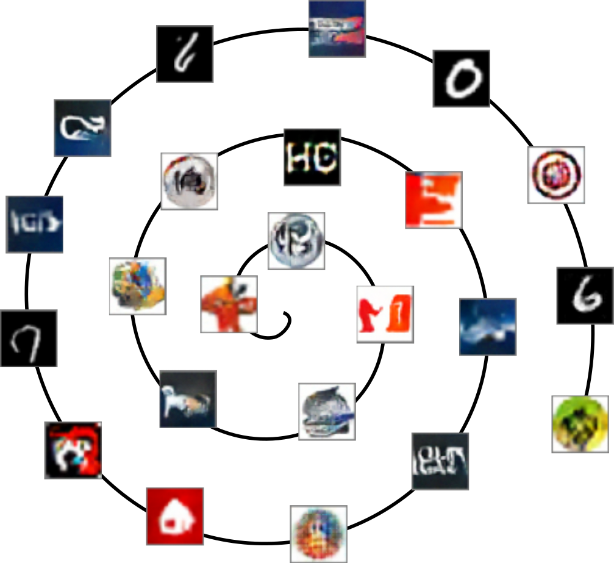
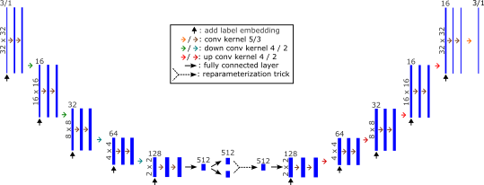
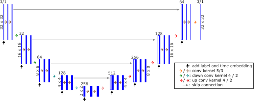

# Generating favicons with pytorch



## Introduction
This is just a small side project of mine to try to generate logos
(to be precise favicons = favorite + icon) with pytorch on my home
computer. 

While the results are not terribly impressive, the diversity of images that
even the small diffusion model used here can generate is quite astounding. 
With some tuning, better results are certainly possible (especially if you
have a newer GPU than my aging 1070Ti).

## Installation
Note: If you do not have an Nvidia GPU, this will probably not work.
1. Use git to clone the repo.
2. Install the environment by opening an [anaconda](https://www.anaconda.com/) prompt and running
   ```conda env create -f environment.yml -n favicon_gen```
   in the `FaviconGen` directory. After the environment has been created, activate it with the command
   ```conda activate favicon_gen```
3. Download the `LLD-icon.hdf5` file from [here](https://data.vision.ee.ethz.ch/sagea/lld/) and
   place it in the `FaviconGen\data` directory (if the directory does not exist create it).
4. Run ```set PYTHONPATH=%cd%``` in your conda prompt to add the `FaviconGen` directory to you
   PYTHONPATH.
5. Running ```dvc repro``` should now train both a Variational AutoEncoder (VAE) and a denoising 
   diffusion model and generate some images. This can take quite a while (you may want to reduce the 
   amount of epochs in the `FavcionGen\favicon_gen\params.py` file before running the command to make
   sure everything works). If the estimated time is extremely long (as in >several hours), you may want to check
   whether your GPU was recognized by pytorch. To do this, type `python` in the conda prompt with 
   activated `favicon_gen`-environment and run
   ```
   import torch
   print(torch.cuda.is_available())
   ```
   
## (Short) Explanation
Code for reading in the training datasets resides in `data_loading.py`. The models can
be trained either with the Large Logo Database (LLD) dataset [[2]](#2) or the
MNIST dataset [[8]](#8).

The scripts `autoencoder.py` and `denoising_diffusion.py` implement convolutional neural
networks for Variational Autoencoder (VAE) and a denoising diffusion model, respectively.
For a quick overview of the model architectures, see [fig. 1](#fig_1) and [fig.2](#fig_2).
You can change parameters for these two models within the `favicong_gen\params.py` parameter
file.

To learn more about diffusion models, I really recommend reading [[1]](#1), which is a
lot more digestible when accompanied by some [educational YouTube videos](#Educational-Youtube-Videos). 
For more details on VAEs, I found [[5]](#5) quite helpful, though one can also find some
helpful videos and web articles (e.g. [[6]](#6) and [[7]](#7)).

Finally, the script `sample_from_model.py` draws samples from the different models for both MNIST and LLD.
It can also find the nearest neighbor of a generated image within the dataset, which is really helpful
in judging whether the generated images are actually novel or just carbon copies of images already
in the dataset.

<figure>
   
   <figcaption>
      <a id="fig_1">Figure 1:</a>Architecture of the VAE implemented in `favicon_gen/autoencoder.py` (without
      adversarial patch discriminator).  
   </figcaption>
</figure>

<figure>
   
   <figcaption>
      <a id="fig_2">Figure 2:</a>Architecture of the diffusion model implemented in
      `favicon_gen/denoising_diffusion.py`.  
   </figcaption>
</figure>

## Educational YouTube videos
Aside from the great [references](#References) on the subject, there are also some YouTube videos
that helped me enormously. 

Diffusion:
- DeepFinder, ["Diffusion models from scratch in pytorch"](https://www.youtube.com/watch?v=a4Yfz2FxXiY&t=895s)
- Outlier, ["Diffusion Models | Paper Explanation | Math Explained"](https://www.youtube.com/watch?v=HoKDTa5jHvg&t=1374s)
- Outlier, ["Diffusion Models | Pytorch Implementation"](https://www.youtube.com/watch?v=TBCRlnwJtZU&t=1152s)

Variational Autoencoder:
- S. Raschka, ["L17.5 A Variational Autoencoder for Handwritten Digits in PyTorch -- Code Example"](https://www.youtube.com/watch?v=afNuE5z2CQ8&t=892s)


## References
<a id="1">[1]</a> 
J. Ho, A. Jain, and P. Abbeel, "Denoising Diffusion Probabilistic Models" arXiv, 2020,
[URL](http://arxiv.org/abs/2006.11239)

<a id="2">[2]</a>
A. Sage, E. Agustsson, R. Timofte, and L. Van Gool,
"Logo Synthesis and Manipulation with Clustered Generative Adversarial Networks"
in 2018 IEEE/CVF Conference on Computer Vision and Pattern Recognition, 2018,
pp. 5879–5888. DOI: 10.1109/CVPR.2018.00616.

<a id="3">[3]</a>
M. Saeed, "A Gentle Introduction to Positional Encoding in Transformer Models, Part 1" 
Machine Learning Mastery, 2022, [URL](https://machinelearningmastery.com/a-gentle-introduction-to-positional-encoding-in-transformer-models-part-1/)

<a id="4">[4]</a>
J. Ho and T. Salimans, "Classifier-free Diffusion Guidance" arXiv, 2022,
[URL](https://arxiv.org/abs/2207.12598)

<a id="5">[5]</a>
C. Doersch, "Tutorial on Variational Autoencoders" arXiv, 2021,
[URL](http://arxiv.org/abs/1606.05908)

<a id="6">[6]</a>
W. Falcon, "Variational Autoencoder demystified with pytorch implementation" 
towards data science, 2020, [URL](https://towardsdatascience.com/variational-autoencoder-demystified-with-pytorch-implementation-3a06bee395ed)

<a id="7">[7]</a>
J. Rocca, "Understanding Variational Autoencoders (VAEs)"
towards data science, 2019, [URL](https://towardsdatascience.com/understanding-variational-autoencoders-vaes-f70510919f73)

<a id="8">[8]</a>
L. Deng, "The MNIST database of handwritten digit images for machine learning research [best of the web]"
IEEE Signal processing magazine 29 (6), 2012, pp. 141-142. DOI: 10.1109/MSP.2012.2211477